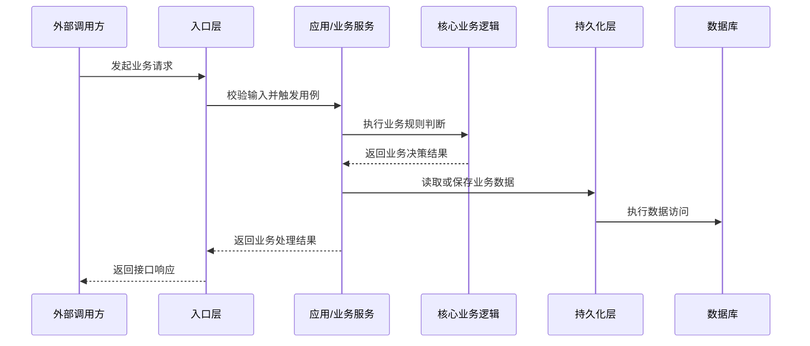

# As-Is 产物模板

as-is 用于先理解现状，再进入方案设计。它需要记录已确认事实、证据、不确定点，以及本次迭代中发现的长期知识候选。

## overview.md

- 需求摘要
- 当前能力边界
- 相关模块
- 已确认事实
- 推断与不确定点
- 当前已知禁区
- 当前已知包袱
- 当前已知暂不重构坏味道

## entrypoints.md

- 入口类型：HTTP/RPC/message/job/CLI/hook/其他
- 入口位置
- 入口参数
- 鉴权 / 权限 / 环境依赖
- 下游调用目标
- 证据文件

## call-chain-sequence.md

必须使用中文业务语义 Mermaid 时序图。消息名写业务动作，不写裸函数名。

## core-logic.md

- 核心业务流程
- 关键分支条件
- 关键状态变化
- 失败/异常路径
- 事务、缓存、异步、定时任务线索
- 兼容行为和历史约束
- 本次需求相关的 safe-to-change area

## data-flow.md

- 输入数据来源
- 中间状态变化
- 输出数据去向
- 持久化读写
- 外部系统交互
- 幂等性和并发线索

## er-diagram.md

必须包含：表名、字段、字段说明、主键、外键/疑似外键、关联证据。关联关系要结合代码推断，不只看数据库结构。

## api-contracts.md

- 入口类型：HTTP/RPC/message/job
- 方法、路径、topic 或 job 名称
- 请求字段
- 响应字段
- 错误码
- 鉴权
- 幂等性线索
- 兼容性风险
- 证据文件

## tests-and-verification.md

- 已有测试
- 可复用验证命令
- 缺失测试
- 必须人工验证的行为面
- 回归风险

## knowledge-candidates.md

记录本次 as-is 发现但尚未确认的长期知识候选。候选知识不要直接合入 `.chisel/wiki/`。

### Forbidden Zone Candidates

- 范围：
- 发现原因：
- 证据：

### Weird But Intentional Candidates

- 现象：
- 可能原因：
- 证据：

### Do Not Refactor Yet Candidates

- 坏味道：
- 本次不要处理的原因：
- 证据：

### Glossary Candidates

- 术语：
- 可能定义：
- 出现位置：

## evidence-index.md

每条结论都尽量关联到文件路径、类/函数、SQL/ORM、配置或测试。
