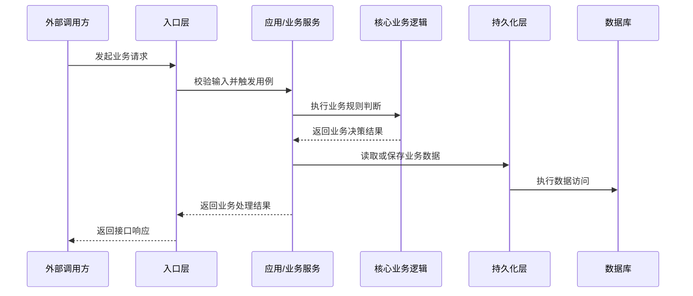

# As-Is 产物模板

## overview.md

- 需求摘要
- 当前能力边界
- 相关模块
- 已确认事实
- 推断与不确定点

## call-chain-sequence.md

必须使用中文业务语义 Mermaid 时序图。消息名写业务动作，不写裸函数名。

## core-logic.md

- 核心业务流程
- 关键分支条件
- 关键状态变化
- 失败/异常路径
- 事务、缓存、异步、定时任务线索

## er-diagram.md

必须包含：表名、字段、字段说明、主键、外键/疑似外键、关联证据。关联关系要结合代码推断，不只看数据库结构。

## api-contracts.md

- 入口类型：HTTP/RPC/message/job
- 方法、路径、topic 或 job 名称
- 请求字段
- 响应字段
- 错误码
- 鉴权
- 幂等性线索
- 兼容性风险
- 证据文件

## evidence-index.md

每条结论都尽量关联到文件路径、类/函数、SQL/ORM、配置或测试。
