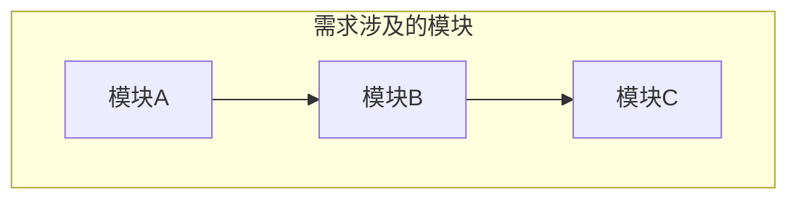
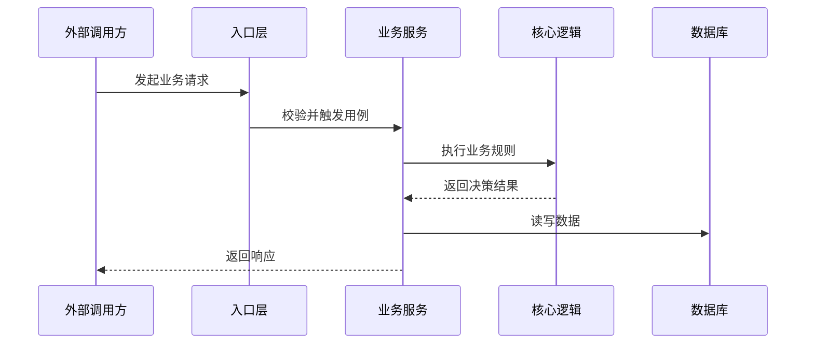
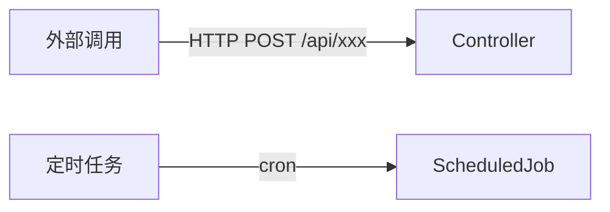
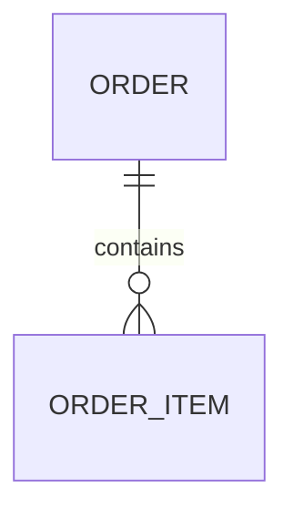

# As-Is 产物模板（人类学习版）

面向人类读者，目标是让用户快速理解**本次需求涉及的系统上下文**。不是全系统代码导览，而是聚焦需求范围的逻辑走查。

## 核心原则

- **需求驱动裁剪**：只产出与本次需求相关的内容，不做全系统扫描
- **主次分明**：主干文件（必读）讲清核心链路，枝干文件（按需）展开细节
- **渐进加载**：主干文件用 `→ 详见 details/xxx.md` 引用枝干，用户按需展开
- **图先行**：每个主干文件至少一个 Mermaid 图，中文业务语义
- **已确认事实标 `[已确认]`，推断标 `[推断]`**

---

## 文件结构

### 主干文件（必须产出，gate 强校验）

| 文件 | 定位 |
|------|------|
| `as-is/overview.md` | 需求相关的系统全景：做什么、核心链路、关键数据、禁区/包袱/不确定点、待澄清问题 |
| `as-is/core-walkthrough.md` | 需求涉及的核心调用链 + 关键分支走查，一个文件讲透主路径 |
| `as-is/evidence-index.md` | 所有结论的证据路径索引 |
| `as-is/knowledge-candidates.md` | 本次发现的禁区/包袱/坏味道/术语候选 |

### 枝干文件（按需产出，主干引用时才创建）

| 文件 | 何时产出 |
|------|---------|
| `as-is/details/entrypoints.md` | 入口数量 > 2 或入口逻辑复杂时 |
| `as-is/details/data-model.md` | 涉及 > 3 张表或数据关系复杂时 |
| `as-is/details/api-contracts.md` | 涉及外部接口契约变更时 |
| `as-is/details/data-flow.md` | 数据流转路径复杂、涉及多系统交互时 |
| `as-is/details/tests.md` | 已有测试需要评估或回归风险高时 |

---

## overview.md

系统全景导读，帮助读者快速建立心智模型。用户读完就能判断"我理解够不够"。



必须包含以下章节（gate 校验）：

### 需求摘要

本次需求要做什么，一段话说清。

### 系统全景

需求涉及哪些模块、它们的关系。一张鸟瞰图 + 一段白话。

### 当前能力边界

当前系统能做什么、不能做什么。

### 核心事实

本次需求相关的 3-8 个关键事实，每条附证据。

### 禁区 / 包袱 / 暂不重构

- 禁区：不能动的区域
- 包袱：看起来奇怪但有原因的设计
- 坏味道：知道不好但当前不动

### 不确定点

推断或未确认的内容，标注置信度。

### 待澄清问题

explorer 在扫描过程中发现的需要用户回答的问题。这是 confirm 阶段的输入。

---

## core-walkthrough.md

需求涉及的核心调用链走查。一个文件讲透主路径，不拆散。



必须包含：

- **核心时序图**：中文业务语义 Mermaid 时序图，消息名写业务动作
- **核心流程图**：关键分支的 Mermaid flowchart + 白话解释
- **状态变化**：关键实体的状态流转
- **异常路径**：失败/降级/回滚路径
- **safe-to-change area**：本次需求可以安全修改的区域
- **枝干引用**：复杂细节用 `→ 详见 details/xxx.md` 引出

---

## 枝干文件模板

### details/entrypoints.md



每个入口：类型、位置、参数、鉴权、下游调用目标、证据。

### details/data-model.md



表结构、字段清单、表间关系白话解释、关联证据。

### details/api-contracts.md

接口清单 + 请求/响应 JSON 示例 + 错误码/鉴权/幂等性。

### details/data-flow.md


数据从哪来、到哪去、中间变换。

### details/tests.md

已有测试、可复用验证命令、缺失测试、回归风险。

---

## evidence-index.md

每条结论关联到文件路径:行号。格式：

```
| 结论 | 证据位置 | 类型 |
|------|---------|------|
| 订单创建走 OrderService | src/service/order.ts:42 | 已确认 |
```

---

## knowledge-candidates.md

记录本次发现但尚未确认的长期知识候选。不自动合入 wiki。

### Forbidden Zone Candidates

- 范围：
- 发现原因：
- 证据：

### Weird But Intentional Candidates

- 现象：
- 可能原因：
- 证据：

### Do Not Refactor Yet Candidates

- 坏味道：
- 本次不处理原因：
- 证据：

### Glossary Candidates

- 术语：
- 可能定义：
- 出现位置：
