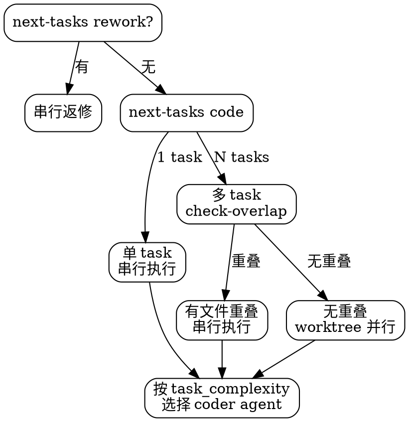

# chisel-implement

实现阶段。只处理脚本返回的可执行 task。

## 当前工作流状态

!`node ${CLAUDE_PLUGIN_ROOT}/scripts/workflow-snapshot.mjs 2>/dev/null || echo "无活跃工作流"`

## 执行流程



1. `node ${CLAUDE_PLUGIN_ROOT}/scripts/workflow-status.mjs {IDEA_DIR} --next-tasks rework`
   - 如有 rework task → 检查 task 文件 frontmatter 中的 `rework_count`：
     - `rework_count >= 2` → 先执行 `/chisel-debug <idea-name> <task-id>` 进行根因调查，再继续返修
     - 否则 → 直接串行返修（返修不并行）
2. 如果没有 rework task，运行 `--next-tasks code`
3. **单 task** → 串行执行：
   - `--start-task <task-id>`
   - 读取 task 文件 frontmatter 的 `task_complexity` 字段，按复杂度选择 coder agent：
     - `trivial` → `agent-chisel-coder-light`（haiku）
     - `standard` 或未指定 → `agent-chisel-coder`（sonnet）
     - `complex` → `agent-chisel-coder-heavy`（opus）
   - 启动选定的 coder agent，传入 TASK：
     ```json
     { "idea_dir": "{IDEA_DIR}", "task_id": "<task-id>", "task_file": "tasks/<task-id>.md" }
     ```
   - coder 完成后运行 `node ${CLAUDE_PLUGIN_ROOT}/scripts/task-metrics.mjs {IDEA_DIR} <task-id>`
   - 检查 coder 返回的 Completion Status：
     - **DONE / DONE_WITH_CONCERNS** → 正常流转（concerns 留在 report 中供 CR 关注）
     - **NEEDS_CONTEXT** → 不调用 `--finish-task`，向用户展示缺失信息，获取后重新派发 coder
     - **BLOCKED** → 向用户报告阻塞原因，等待用户决策
4. **多 task** → Read `${CLAUDE_PLUGIN_ROOT}/skills/chisel-implement/references/phase-parallel-coding.md`，按其流程并行执行

<HARD-GATE>
只有 `--next-tasks` 返回的 task 才能启动。
有依赖的 task 必须串行。
有 expected_files 重叠的 task 必须串行（用 `--check-overlap` 检测）。
无依赖且无文件重叠的 task 通过 Agent worktree 并行——**但前提是 `worktree-decision.json` decision = "worktree"**。若 decision = "current-branch"，所有 task 串行执行，不使用 Agent worktree 隔离。

合理化预防表：

| 你的想法 | 现实 |
|---------|------|
| "这个 task 太简单不需要 report" | 每个 task 必须有 report |
| "scope-check 肯定过，跳过" | 越界是最常见的返修原因 |
| "顺便修一下旁边的代码" | 超范围修改会触发 scope 违规 |
</HARD-GATE>
