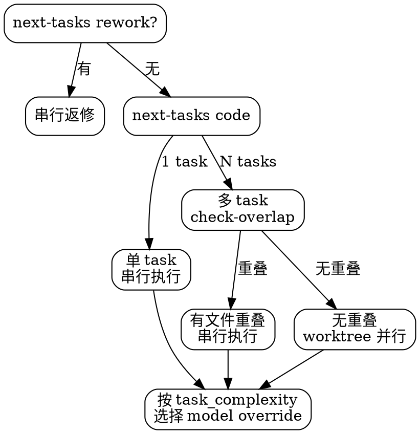

# chisel-implement

实现阶段。只处理脚本返回的可执行 task。

## 当前工作流状态

!`node ${CLAUDE_PLUGIN_ROOT}/scripts/workflow-snapshot.mjs 2>/dev/null || echo "无活跃工作流"`

## 执行流程

编码前只初始化一次独立验收 Oracle：

```bash
node ${CLAUDE_PLUGIN_ROOT}/scripts/oracle-prepare.mjs {IDEA_DIR} .
```

若返回 `status: prepared`，启动 `agent-chisel-oracle`，TASK 只传：

```json
{ "oracle_context_path": "{IDEA_DIR}/oracle/context.json", "output_directory": "{IDEA_DIR}/oracle" }
```

Oracle 不得接收或读取 plan、task、report、diff；生成的断言在编码前冻结。若无稳定公开入口，Oracle 写
`status: not_applicable`，不得靠猜测制造验收项。若返回 `status: frozen`，直接复用已有产物，返修时禁止重新生成。


```dot
digraph implement_flow {
  rankdir=TB; node [shape=box, style=rounded];
  start [label="next-tasks rework?"];
  rework [label="串行返修"];
  code [label="next-tasks code"];
  single [label="单 task\n串行执行"];
  multi [label="多 task\ncheck-overlap"];
  overlap [label="有文件重叠\n串行执行"];
  parallel [label="无重叠\nworktree 并行"];
  select [label="按 task_complexity\n选择 model override"];

  start -> rework [label="有"];
  start -> code [label="无"];
  code -> single [label="1 task"];
  code -> multi [label="N tasks"];
  multi -> overlap [label="重叠"];
  multi -> parallel [label="无重叠"];
  single -> select;
  overlap -> select;
  parallel -> select;
}
```

1. `node ${CLAUDE_PLUGIN_ROOT}/scripts/workflow-status.mjs {IDEA_DIR} --next-tasks rework`
   - 如有 rework task → 检查 task 文件 frontmatter 中的 `rework_count`：
     - `rework_count >= 2` → 先执行 `/chisel-debug <idea-name> <task-id> --return-diagnosis` 进行 reproduce-first 根因调查，再继续返修
     - 否则 → 直接串行返修（返修不并行）
   - **返修策略**（统一使用 `agent-chisel-coder`，通过 model override 区分档位）：
     - `rework_count 1-2`：保持当前 model 配置（保持上下文连续性）
     - `rework_count 3`：模型升级
       - `trivial`/`standard`（原为继承主编排器模型）→ model override: opus
       - `complex` (原 opus) → 不变（已是最高）
     - `rework_count 4-5`：**Fresh Agent 重做**——启动一个全新的 `agent-chisel-coder`（不继承前序 repair 上下文），model override: opus，agent prompt 追加：
       ```
       ⚠️ 前任实现者已尝试 {rework_count} 轮修复未通过。
       你是全新接管者。请从用户确认的权威需求、实际源码、运行结果和 CR findings 出发独立实现，不要延续前任的修复方向。
       已知失败路径记录在 debug/{task-id}-debug.json（由 `scripts/debug-workflow.mjs` 契约校验）。
       ```
     - 升级记录写入 `task-metrics.mjs` 的 `escalated_model` 和 `fresh_agent` 字段
2. 如果没有 rework task，运行 `--next-tasks code`
3. **单 task** → 串行执行：
   - `--start-task <task-id> --project-root . --owner main-orchestrator`；保存返回的 `run_id`，后续 heartbeat 和 finish 必须使用它
   - 读取 task 文件 frontmatter 的 `task_complexity` 字段，选择 model override：
     - `trivial` / `standard` 或未指定 → `agent-chisel-coder`（继承主编排器当前模型）
     - `complex` → `agent-chisel-coder`，model override: opus
   - 生成轻量 coder bootstrap：`node ${CLAUDE_PLUGIN_ROOT}/scripts/coder-prepare.mjs {IDEA_DIR} <task-id> .`。stdout 只包含路径、hash/体积指标和文件计数；需求、计划与源码正文保留在文件中，由 Coder 使用 `context-query.mjs` 循环检索，主编排器不得 Read bootstrap 或源文件全文后再转述给 Coder
   - 启动选定的 coder agent，传入 TASK：
   - 启动前运行 `node ${CLAUDE_PLUGIN_ROOT}/scripts/session-metrics.mjs {IDEA_DIR} --agent-call implement:code coder 1`；返修模式将 step 改为 `repair:code`
     ```json
     { "idea_dir": "{IDEA_DIR}", "task_id": "<task-id>", "task_file": "tasks/<task-id>.md", "run_id": "<run-id>" }
     ```
   - 检查 coder 不超过 5 行的返回结果：
     - **DONE / DONE_WITH_CONCERNS** → 主编排器检查实际 diff 非空，然后使用 `--finish-task <task-id> coded --run-id <run-id>` 冻结 provenance
     - **NEEDS_CONTEXT** → 不调用 `--finish-task`。向用户展示缺失信息；收到回答后先按
       `chisel-clarify` 的追加输入协议写入 `requirement-inputs.json`，重新综合并展示完整 `requirement.md`。
       当前需求 hash 经用户确认、`clarification-complete` gate 重新通过后，再重新生成 coder-context 并派发 coder。
       禁止把回答只拼进 agent prompt。
     - **BLOCKED** → 向用户报告阻塞原因，等待用户决策
   - finish 成功后运行 `node ${CLAUDE_PLUGIN_ROOT}/scripts/task-metrics.mjs {IDEA_DIR} <task-id>`；脚本从 Git diff 自动生成轻量 task inventory，Coder 不写 report
   - 运行 `scope-check.mjs`：明确 forbidden path/symbol 命中才返修；`starting_points` 外扩展和大范围信号交给 reviewer，不要求 Coder 缩回错误的预测范围
   - 运行 `gate-check.mjs {IDEA_DIR} task-report-exists`，只校验自动 inventory 与 task provenance 一致
4. **多 task** → Read `${CLAUDE_PLUGIN_ROOT}/skills/chisel-implement/references/phase-parallel-coding.md`，按其流程并行执行

> **并行 Agent 不能成为停止点。** 如使用后台 Agent，主编排器必须用 `TaskOutput(task_id, block: true)` 等待并收割全部结果，再完成 merge、finish、report/scope 校验和后续调度；禁止以“仍在后台运行，等待完成通知”为由结束当前 turn。

### Post-coding Build Verification

长耗时编码或验证前，运行 `workflow-status.mjs {IDEA_DIR} --heartbeat <task-id> --run-id <run-id>` 续租。只有主编排器能使用 `--finish-task`；Coder 不修改工作流状态，旧 run 不得提交。

首次实现完成时，先生成并检查显式验证契约，再执行全量验证：

```bash
node ${CLAUDE_PLUGIN_ROOT}/scripts/verify-run.mjs {IDEA_DIR} . --init-contract
# 检查 required checks，并为本次需求单测补充 requirement_cases
node ${CLAUDE_PLUGIN_ROOT}/scripts/verify-run.mjs {IDEA_DIR} . --full
```

`--init-contract` stdout 的 `contract` 和验证 stdout 的 `result_file` 是权威绝对路径。只按这些字段读取文件；不得从当前
worktree 手拼 `.chisel/...`，不得用 `cd ..` 搜索控制目录，也不得复制 `verify-run.mjs` 或其依赖到临时目录运行。

`verification-contract.json` 中每个含单测 check 的 repo 必须填写轻量 `requirement_cases`。每项只记录一条真实业务行为，不复制测试代码：

```json
{
  "id": "CASE-001",
  "test_file": "tests/order.test.js",
  "test_name": "rejects checkout when stock is insufficient",
  "trace_refs": ["AC-002/VC-001"],
  "given": "库存少于下单数量",
  "when": "用户提交结算",
  "then": "返回库存不足且不创建订单",
  "failure_mode": "库存校验被删除、分支写反或错误地产生订单",
  "check_id": "unit-test-coverage",
  "pass_evidence": "ok 3 - rejects checkout when stock is insufficient"
}
```

要求：`trace_refs` 必须来自需求追踪矩阵；Given/When/Then 必须表达调用方可观察结果；`failure_mode` 必须说明哪类真实业务破坏会让 case 失败；断言应落在真实代码行为而非 mock 调用次数、常量文本或与实现共用的 expected builder。`pass_evidence` 是测试运行输出中的唯一原文标记，必要时把测试命令调整为 verbose。运行器只有在命令 exit 0、测试文件存在且输出确实包含该标记时才记录 PASS，并绑定命令、耗时、输出片段与测试文件 SHA-256。修改或新增的每个测试文件至少要有一个这样的 case；不要求为未改动的历史回归用例逐条补录。

返修完成时不要重复执行完整测试矩阵。根据本轮 CR findings、`affected_tasks`、实际 repair diff 和 task Verification Plan 写入
`repair-verification-plan.json`：

```json
{
  "schema_version": 1,
  "affected_files": ["src/example.js"],
  "affected_dimensions": ["spec", "d4"],
  "repositories": [{
    "project_root": ".",
    "checks": [{ "id": "targeted-unit", "command": "npm", "args": ["test", "--", "tests/example.test.js"] }],
    "requirement_cases": [{
      "id": "CASE-001", "test_file": "tests/example.test.js", "test_name": "returns the required result",
      "trace_refs": ["AC-001"], "given": "有效输入", "when": "执行目标功能", "then": "返回需求结果",
      "failure_mode": "目标分支缺失或返回错误", "check_id": "targeted-unit", "pass_evidence": "PASS returns the required result"
    }]
  }]
}
```

`affected_files` 和 checks 必须非空，checks 必须覆盖本轮修改直接影响的测试。随后运行：

```bash
node ${CLAUDE_PLUGIN_ROOT}/scripts/verify-run.mjs {IDEA_DIR} . --incremental
```

增量结果绑定当前 Git HEAD、工作区指纹和 plan fingerprint，只允许进入返修复审。全部 findings 清零后，
orchestration-status 会再次返回 `test:unit` 且 `verification_mode=full-final`；此时必须运行 `--full`、更新覆盖率证据和 Test HTML，作为最终封板。

读取 `{IDEA_DIR}/verify-result.json`：
- `status: "pass"` → 正常流转，等待 orchestration-status 派发 review。结果绑定当前 Git HEAD 和工作区指纹；验证后代码再变化会使 gate 失效，必须重跑
- `status: "fail"` → 检查 output 中的错误信息：
  - 如果是编译/类型错误且涉及本次修改的文件 → 直接修复（不启动新 coder agent）
  - 修复后重新运行 `verify-run.mjs`
  - 最多尝试修复 2 次；仍失败则保持在 implement/repair，报告明确阻塞原因，不得进入 CR
- 未检测到验证命令时结果为 `fail`；先从项目说明、CI 或用户输入补充可重复执行的验证命令，不得以 skip 代替验证

项目全量验证通过后（首次 `--full` 或最终 `full-final`），执行冻结的独立验收：

```bash
node ${CLAUDE_PLUGIN_ROOT}/scripts/oracle-run.mjs {IDEA_DIR} .
```

- `pass` / `not_applicable` → 继续 review
- `fail` → 把 `oracle/result.json` 中的失败断言和运行输出作为返修信号交给 Coder；不要补充 plan 对失败的解释
- Coder 修复后重跑受影响的项目测试和同一份 Oracle，最多 2 轮；禁止重写断言来适配实现
- Oracle 未生成 manifest、脚本不可执行、断言数不在 1–12，或 `not_applicable` 缺少规范 reason_code 时，视为 Oracle 产物错误，不伪装成代码失败；修正产物后再运行

验证通过后运行 `node ${CLAUDE_PLUGIN_ROOT}/scripts/phase-artifacts.mjs {IDEA_DIR} implement:code`（返修阶段用 `repair:code`），将 stdout 原样输出到对话，再继续 review。自动 task inventory 只是机器记录，不要求逐 task 展示或让用户确认。

<HARD-GATE principle="P2">
只有 `--next-tasks` 返回的 task 才能启动。
有依赖的 task 必须串行。
Plan 的 `expected_files` 仅在内部作为初始冲突调度提示；发生重叠时串行（用 `--check-overlap` 检测），不得把它传递成 Coder 的修改边界。
无依赖且无文件重叠的 task 通过 Agent worktree 并行——**但前提是 `worktree-decision.json` decision = "worktree"**。若 decision = "current-branch"，所有 task 串行执行，不使用 Agent worktree 隔离。

合理化预防表：

| 你的想法 | 现实 |
|---------|------|
| "task brief 已经列全了文件" | starting_points 只是导航，必须自行追 caller、依赖和测试 |
| "修改计划外文件会违规" | 只有明确 forbidden path/symbol 是硬边界 |
| "让 Coder 补一份证明更可靠" | inventory、trace 和 scope 记录由脚本/reviewer生成，Coder 专注代码与测试 |
</HARD-GATE>
