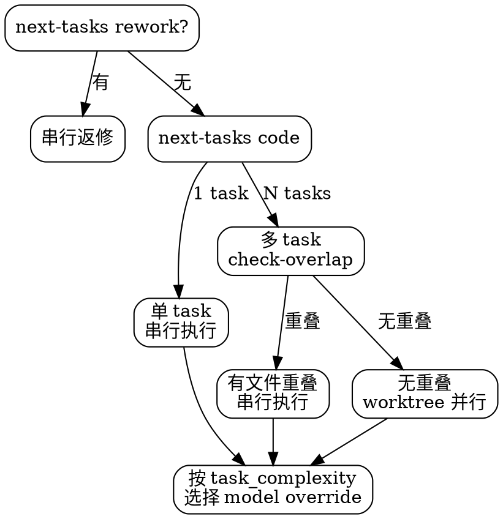

# chisel-implement

实现阶段。只处理脚本返回的可执行 task。

## 当前工作流状态

!`node ${CLAUDE_PLUGIN_ROOT}/scripts/workflow-snapshot.mjs 2>/dev/null || echo "无活跃工作流"`

## 执行流程


```dot
digraph implement_flow {
  rankdir=TB; node [shape=box, style=rounded];
  start [label="next-tasks rework?"];
  rework [label="串行返修"];
  code [label="next-tasks code"];
  single [label="单 task\n串行执行"];
  multi [label="多 task\ncheck-overlap"];
  overlap [label="有文件重叠\n串行执行"];
  parallel [label="无重叠\nworktree 并行"];
  select [label="按 task_complexity\n选择 model override"];

  start -> rework [label="有"];
  start -> code [label="无"];
  code -> single [label="1 task"];
  code -> multi [label="N tasks"];
  multi -> overlap [label="重叠"];
  multi -> parallel [label="无重叠"];
  single -> select;
  overlap -> select;
  parallel -> select;
}
```

1. `node ${CLAUDE_PLUGIN_ROOT}/scripts/workflow-status.mjs {IDEA_DIR} --next-tasks rework`
   - 如有 rework task → 检查 task 文件 frontmatter 中的 `rework_count`：
     - `rework_count >= 2` → 先执行 `/chisel-debug <idea-name> <task-id>` 进行根因调查，再继续返修
     - 否则 → 直接串行返修（返修不并行）
   - **返修策略**（统一使用 `agent-chisel-coder`，通过 model override 区分档位）：
     - `rework_count 1-2`：保持当前 model 配置（保持上下文连续性）
     - `rework_count 3`：模型升级
       - `trivial`/`standard` (原 sonnet) → model override: opus
       - `complex` (原 opus) → 不变（已是最高）
     - `rework_count 4-5`：**Fresh Agent 重做**——启动一个全新的 `agent-chisel-coder`（不继承前序 repair 上下文），model override: opus，agent prompt 追加：
       ```
       ⚠️ 前任实现者已尝试 {rework_count} 轮修复未通过。
       你是全新接管者。请从 task brief 和 CR findings 出发独立实现，不要延续前任的修复方向。
       已知失败路径记录在 debug/{task-id}-debug.md。
       ```
     - 升级记录写入 `task-metrics.mjs` 的 `escalated_model` 和 `fresh_agent` 字段
2. 如果没有 rework task，运行 `--next-tasks code`
3. **单 task** → 串行执行：
   - `--start-task <task-id> --project-root . --owner main-orchestrator`；保存返回的 `run_id`，后续 heartbeat 和 finish 必须使用它
   - 读取 task 文件 frontmatter 的 `task_complexity` 字段，选择 model override：
     - `trivial` / `standard` 或未指定 → `agent-chisel-coder`（默认 sonnet）
     - `complex` → `agent-chisel-coder`，model override: opus
   - 预打包 coder 上下文：`node ${CLAUDE_PLUGIN_ROOT}/scripts/coder-prepare.mjs {IDEA_DIR} <task-id> .`
   - 启动选定的 coder agent，传入 TASK：
     ```json
     { "idea_dir": "{IDEA_DIR}", "task_id": "<task-id>", "task_file": "tasks/<task-id>.md", "run_id": "<run-id>" }
     ```
   - coder 完成后运行 `node ${CLAUDE_PLUGIN_ROOT}/scripts/task-metrics.mjs {IDEA_DIR} <task-id>`
   - 检查 coder 返回的 Completion Status：
     - **DONE / DONE_WITH_CONCERNS** → 正常流转（concerns 留在 report 中供 CR 关注）
     - **NEEDS_CONTEXT** → 不调用 `--finish-task`，向用户展示缺失信息，获取后重新派发 coder
     - **BLOCKED** → 向用户报告阻塞原因，等待用户决策
4. **多 task** → Read `${CLAUDE_PLUGIN_ROOT}/skills/chisel-implement/references/phase-parallel-coding.md`，按其流程并行执行

### Post-coding Build Verification

长耗时编码或验证前，运行 `workflow-status.mjs {IDEA_DIR} --heartbeat <task-id> --run-id <run-id>` 续租。coder 完成后使用 `--finish-task <task-id> coded --run-id <run-id>`；旧 run 不得提交。

当所有 task 完成（进入 review 前），先生成并检查显式验证契约，再执行验证：

```bash
node ${CLAUDE_PLUGIN_ROOT}/scripts/verify-run.mjs {IDEA_DIR} . --init-contract
# 检查 verification-contract.json 中每个 repo 的 required checks，必要时补充 CI/项目特有命令
node ${CLAUDE_PLUGIN_ROOT}/scripts/verify-run.mjs {IDEA_DIR} .
```

读取 `{IDEA_DIR}/verify-result.json`：
- `status: "pass"` → 正常流转，等待 orchestration-status 派发 review。结果绑定当前 Git HEAD 和工作区指纹；验证后代码再变化会使 gate 失效，必须重跑
- `status: "fail"` → 检查 output 中的错误信息：
  - 如果是编译/类型错误且涉及本次修改的文件 → 直接修复（不启动新 coder agent）
  - 修复后重新运行 `verify-run.mjs`
  - 最多尝试修复 2 次；仍失败则保持在 implement/repair，报告明确阻塞原因，不得进入 CR
- 未检测到验证命令时结果为 `fail`；先从项目说明、CI 或用户输入补充可重复执行的验证命令，不得以 skip 代替验证

<HARD-GATE principle="P2">
只有 `--next-tasks` 返回的 task 才能启动。
有依赖的 task 必须串行。
有 expected_files 重叠的 task 必须串行（用 `--check-overlap` 检测）。
无依赖且无文件重叠的 task 通过 Agent worktree 并行——**但前提是 `worktree-decision.json` decision = "worktree"**。若 decision = "current-branch"，所有 task 串行执行，不使用 Agent worktree 隔离。

合理化预防表：

| 你的想法 | 现实 |
|---------|------|
| "这个 task 太简单不需要 report" | 每个 task 必须有 report |
| "scope-check 肯定过，跳过" | 越界是最常见的返修原因 |
| "顺便修一下旁边的代码" | 超范围修改会触发 scope 违规 |
</HARD-GATE>
