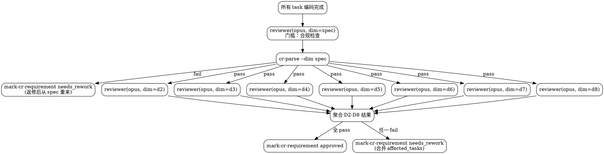

# chisel-review

多维度独立 CR 阶段。所有 task 编码完成后，每个维度由独立的 opus 调用深度审查。不直接改业务代码。

## 当前工作流状态

!`node ${CLAUDE_PLUGIN_ROOT}/hooks/workflow-snapshot.mjs 2>/dev/null || echo "无活跃工作流"`

## Trivial 快速路径（review:cr-light）

如果当前需求复杂度为 `trivial`（检测方式：读取 `{IDEA_DIR}/requirement.md` 判断复杂度），则：
- **只执行第一步（Spec 门槛）**
- Spec pass → 直接 `--mark-cr-requirement approved`，流程结束
- Spec fail → `--mark-cr-requirement needs_rework`，流程结束
- **不进入第二步和第三步（D2-D8 并行审查）**

## 核心理念

CR diff loop 是 chisel 的质量保障核心：审查 → 返修 → 再审查，直到通过。

**从 diff 出发，聚焦当前功能变更。** reviewer 的主材料是功能分叉点以来的行级 diff，不是全文件。只有当 diff 上下文不足以判断（调用方、继承关系、数据流上下游）时，才按需读取相关文件片段作为补充。

每个维度独立一次 opus 调用，注意力最集中。通用 reviewer agent 加载不同维度定义文件执行审查。

## 审查维度

| 维度 | 职责 | 阶段 |
|------|------|------|
| spec | AC 覆盖、scope、forbidden files、behavior invariants | 门槛（fail 直接返修） |
| D2 | 并发与分布式安全 | 质量（全量审查后聚合） |
| D3 | 代码去重 | 质量 |
| D4 | 设计原则符合性 | 质量 |
| D5 | 风格一致性 | 质量 |
| D6 | 可维护性与迭代支持 | 质量 |
| D7 | 无效代码清除（三环孤儿检测） | 质量 |
| D8 | 影响面追踪（涟漪效应） | 质量 |

## 执行流程



### 第零步：确定 diff 基准

在开始任何审查维度之前，确定功能分叉点作为 diff 基准：

```bash
# 从 worktree-decision.json 读取 base commit（支持 v1 单仓和 v2 多仓）
node -e "
const d=JSON.parse(require('fs').readFileSync('{IDEA_DIR}/worktree-decision.json','utf8'));
if (d.schema_version === 2 && Array.isArray(d.repos)) {
  // 多仓模式：匹配当前仓库路径获取对应 base_commit
  const cwd = process.cwd();
  const repo = d.repos.find(r => cwd.startsWith(require('path').resolve(r.worktree_path || r.path)));
  console.log(repo?.base_commit || d.repos[0]?.base_commit || '');
} else {
  console.log(d.base_commit || '');
}
" 2>/dev/null || echo ""
```

- 如果有值 → 设为 `{BASE_REF}`
- 如果为空 → 尝试 `git merge-base main HEAD`，有值则用之
- 仍为空 → `{BASE_REF}` 留空，reviewer 会降级到 `git log -p`

后续所有 reviewer agent 调用都传入 `base_ref: "{BASE_REF}"`。

### 第一步：Spec 门槛

1. `node ${CLAUDE_PLUGIN_ROOT}/scripts/workflow-status.mjs {IDEA_DIR} --next-tasks review`
2. 对所有待 review 的 task，`--start-review <task-id>` 标记为 reviewing
3. 启动 `agent-chisel-reviewer`（opus），传入 TASK：
   ```json
   { "idea_dir": "{IDEA_DIR}", "task_ids": ["task-001", "task-002", ...], "dimension": "spec", "rework_count": 0, "base_ref": "{BASE_REF}" }
   ```
4. `node ${CLAUDE_PLUGIN_ROOT}/scripts/cr-parse.mjs {IDEA_DIR} --dim spec`
5. 按结果：
   - **fail** → `node ${CLAUDE_PLUGIN_ROOT}/scripts/workflow-status.mjs {IDEA_DIR} --mark-cr-requirement needs_rework <affected_tasks>`，停止
   - **pass** → 进入第二步

### 第 1.5 步：预计算共享上下文

5.5. Spec 通过后、D2-D8 启动前，运行一次预计算：
   ```bash
   node ${CLAUDE_PLUGIN_ROOT}/scripts/cr-prepare.mjs {IDEA_DIR} "{BASE_REF}" .
   ```
   产出 `{IDEA_DIR}/cr/cr-context.json`，包含：
   - 所有待审查 task 的文件内容和 report
   - 统一 git diff（只跑一次）
   - 每个 task 的 scope-check 结果
   - wiki 查询结果

   后续 D2-D8 agent 优先从 cr-context.json 读取，避免重复计算。

### 第二步：条件激活 + D2-D8 并行质量审查

在发起 D2-D8 之前，分析变更文件特征，决定哪些维度需要激活：

```bash
# 收集所有 task report 的 changed_files，合并为列表
# 对合并后的变更文件执行特征检测
```

| 维度 | 激活条件 | 不激活时处理 |
|------|---------|-------------|
| D2 并发/错误处理 | 变更文件中含 async/await/thread/lock/mutex/concurrent/Promise/channel 或 try/catch/except/error/throw 关键字 | 写入 `cr/dim-d2-cr.md`（result: pass, 理由: "变更未涉及并发或错误处理代码，自动跳过"） |
| D3 去重 | 始终激活 | — |
| D4 设计原则 | 始终激活 | — |
| D5 风格一致性 | 始终激活 | — |
| D6 可维护性 | 始终激活 | — |
| D7 孤儿检测 | 变更涉及删除/重命名文件，或 diff 中有函数/类定义被删除 | 写入 `cr/dim-d7-cr.md`（result: pass, 理由: "变更未删除/重命名代码，无孤儿风险"） |
| D8 影响面 | 变更涉及 export/public/module.exports 或函数签名变更 | 写入 `cr/dim-d8-cr.md`（result: pass, 理由: "变更未修改公共 API 或接口签名"） |

检测方式：对变更文件 `grep -l` 关键字模式。一个维度只要任一变更文件命中即激活。

分两批启动已激活维度，避免过多 opus agent 同时竞争导致 stall：

6a. **Batch 1**——在一条消息中发起前 4 个已激活维度的 Agent 调用：
   ```
   Agent({ description: "CR D2", prompt: TASK({ dimension: "d2", ..., "base_ref": "{BASE_REF}" }) })
   Agent({ description: "CR D3", prompt: TASK({ dimension: "d3", ..., "base_ref": "{BASE_REF}" }) })
   Agent({ description: "CR D4", prompt: TASK({ dimension: "d4", ..., "base_ref": "{BASE_REF}" }) })
   Agent({ description: "CR D5", prompt: TASK({ dimension: "d5", ..., "base_ref": "{BASE_REF}" }) })
   ```

6b. 等待 Batch 1 全部返回后，**Batch 2**——再发起 3 个 Agent 调用：
   ```
   Agent({ description: "CR D6", prompt: TASK({ dimension: "d6", ..., "base_ref": "{BASE_REF}" }) })
   Agent({ description: "CR D7", prompt: TASK({ dimension: "d7", ..., "base_ref": "{BASE_REF}" }) })
   Agent({ description: "CR D8", prompt: TASK({ dimension: "d8", ..., "base_ref": "{BASE_REF}" }) })
   ```

   每批 reviewer 并行执行，各自读取对应 `dim-{dimension}.md` 定义和 `cr-context.json`。

### 第三步：验证 + 聚合结果

7. 等待所有 Agent 返回后，逐个运行 `node ${CLAUDE_PLUGIN_ROOT}/scripts/cr-parse.mjs {IDEA_DIR} --dim <dimension>` 解析结果

8. **验证子阶段**（仅当存在 fail 维度时执行）：
   对每个 fail 维度的 CR 文件中的 Rework Items，启动 **sonnet** 验证 agent（非 opus，降本）：
   - 验证 agent 获取：PR diff（`git diff {BASE_REF}...HEAD`）+ Rework Item 描述
   - 验证 agent 独立确认该问题是否为真实问题
   - 未通过验证的 item → 从 Rework Items 移到 Observations (non-blocking)
   - 全部 Rework Items 被否决 → 该维度的 result 改为 pass
   - 验证后更新 CR 文件的 frontmatter 和 Rework Items 表

   每个 fail item 一个独立验证 agent，可并行发起。

9. 聚合判定：
   - **全部 pass** → `node ${CLAUDE_PLUGIN_ROOT}/scripts/workflow-status.mjs {IDEA_DIR} --mark-cr-requirement approved`
   - **任一 fail** → 合并所有 fail 维度的 affected_tasks（去重）→ `node ${CLAUDE_PLUGIN_ROOT}/scripts/workflow-status.mjs {IDEA_DIR} --mark-cr-requirement needs_rework <affected_tasks>`

`--mark-cr-requirement` 是 task 状态机的需求级批量更新命令，不代表必须生成 `cr/requirement-cr.md`。新 CR contract 以 `cr/dim-spec-cr.md` 和 `cr/dim-d2-cr.md` 到 `cr/dim-d8-cr.md` 为准；`cr/requirement-cr.md` 仅为旧运行态兼容产物。

<HARD-GATE>
每个维度独立一次 opus 调用，不合并维度。
spec 是门槛——fail 直接返修，不跑后续质量维度。
D2-D8 中未激活的维度自动写 pass CR 文件（含跳过理由），已激活维度分两批（4+3）发起 Agent 调用，避免并发 stall。
聚合前必须执行验证子阶段——fail item 经 sonnet 验证后才能确认。
聚合后一次性收集所有问题避免反复返修。
返修后必须从 spec 重新开始，不能跳过。
上次通过不等于这次通过。
同一 task 返修 3 次后会被脚本标记为 blocked。
必须用 cr-parse.mjs 解析 frontmatter，不得根据正文猜测结论。

合理化预防表：

| 你的想法 | 现实 |
|---------|------|
| "spec 已通过，后续维度走个过场" | spec 只管合规，质量需要独立深度审查 |
| "这个维度和本次改动无关，跳过" | 用条件激活机制判断，不手动跳过——始终激活的维度（D3-D6）不能跳 |
| "改动很小，用一次调用审查多个维度" | 每个维度独立调用，注意力不稀释 |
| "上轮 CR 已经很详细，这轮快过" | 每轮必须独立审查 |
| "CR 报告中说了通过就行" | 必须用 cr-parse.mjs 解析 frontmatter |
| "只有一个 task，不需要完整流程" | 单 task 也走完整流程 |
| "diff 不够看，先读全文件再审" | diff 是主材料，全文件只是补充——先从 diff 出发 |
| "验证子阶段太慢，跳过" | 验证是假阳性控制的关键环节，不可跳过 |
| "cr-context.json 存在就不用跑 scope-check 了" | cr-context 预计算的结果直接用，但 proof 必须如实填入报告 |
</HARD-GATE>
