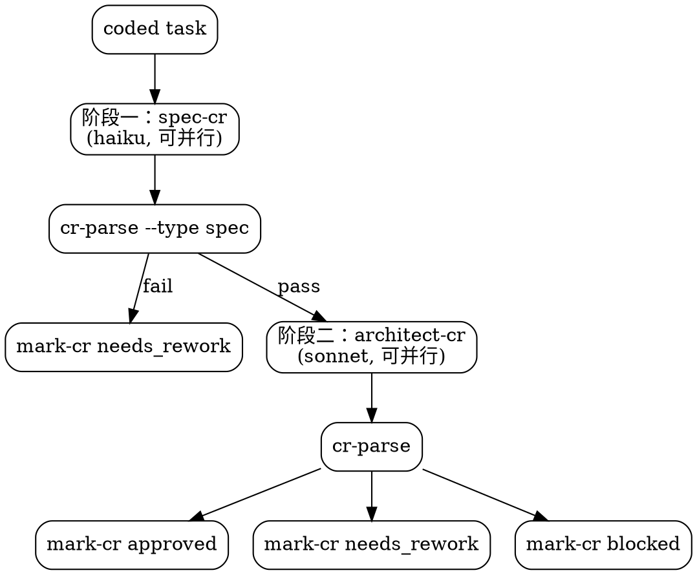

# chisel-review

CR 阶段。不直接改业务代码。

## 当前工作流状态

!`node ${CLAUDE_PLUGIN_ROOT}/hooks/workflow-snapshot.mjs 2>/dev/null || echo "无活跃工作流"`

## 执行流程

采用两阶段 CR：阶段一（规格合规）拦截低级错误，阶段二（架构质量）深度审查。



1. `node ${CLAUDE_PLUGIN_ROOT}/scripts/workflow-status.mjs {IDEA_DIR} --next-tasks review`
2. 对每个待 review 的 task，串行调用 `--start-review <task-id>`
3. **阶段一：规格合规检查**（轻量，可并行）
   - 启动 `agent-chisel-spec-reviewer`，传入 TASK：
     ```json
     { "idea_dir": "{IDEA_DIR}", "task_id": "<task-id>" }
     ```
   - 多 task 时在同一条消息中并行启动多个 spec-reviewer
   - 完成后运行 `node ${CLAUDE_PLUGIN_ROOT}/scripts/cr-parse.mjs {IDEA_DIR} <task-id> --type spec`
   - **fail** → 直接 `--mark-cr <task-id> needs_rework`，跳过阶段二
   - **pass** → 进入阶段二
4. **阶段二：架构质量审查**（仅对阶段一通过的 task）
   - 启动 `agent-chisel-architect-reviewer`，传入 TASK：
     ```json
     { "idea_dir": "{IDEA_DIR}", "task_id": "<task-id>" }
     ```
   - 多 task 时可并行派发（reviewer 只读，无需 worktree 隔离）
   - CR 完成后运行 `node ${CLAUDE_PLUGIN_ROOT}/scripts/cr-parse.mjs {IDEA_DIR} <task-id>` 解析 frontmatter 中的 `result`
   - 用解析到的结论运行 `--mark-cr <task-id> <result>`；解析失败必须返工补齐 CR frontmatter，不得根据正文猜测结论

<HARD-GATE>
每个 coded task 必须独立 CR。
上次通过不等于这次通过。
同一 task 返修 3 次后会被脚本标记为 blocked。

合理化预防表：

| 你的想法 | 现实 |
|---------|------|
| "代码改动很小，直接 approved" | 小改动也可能破坏不变量 |
| "上轮 CR 已经很详细，这轮快过" | 每轮 CR 必须独立评估 |
| "CR 报告中说了通过就行" | 必须用 cr-parse.mjs 解析 frontmatter，不得根据正文猜测 |
</HARD-GATE>
