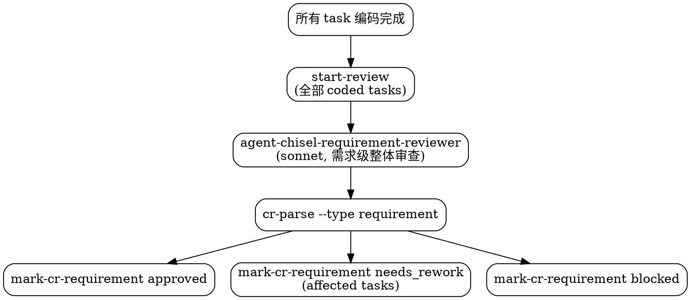

# chisel-review

需求级 CR 阶段。所有 task 编码完成后进行整体架构审查。不直接改业务代码。

## 当前工作流状态

!`node ${CLAUDE_PLUGIN_ROOT}/hooks/workflow-snapshot.mjs 2>/dev/null || echo "无活跃工作流"`

## 执行流程



1. `node ${CLAUDE_PLUGIN_ROOT}/scripts/workflow-status.mjs {IDEA_DIR} --next-tasks review`
2. 对所有待 review 的 task，逐个调用 `--start-review <task-id>` 标记为 reviewing
3. 启动 `agent-chisel-requirement-reviewer`，传入 TASK：
   ```json
   { "idea_dir": "{IDEA_DIR}", "task_ids": ["task-001", "task-002", ...] }
   ```
4. CR 完成后运行 `node ${CLAUDE_PLUGIN_ROOT}/scripts/cr-parse.mjs {IDEA_DIR} --type requirement` 解析 `cr/requirement-cr.md` 的 frontmatter
5. 按解析到的结论执行：
   - **approved** → `node ${CLAUDE_PLUGIN_ROOT}/scripts/workflow-status.mjs {IDEA_DIR} --mark-cr-requirement approved`
   - **needs_rework** → `node ${CLAUDE_PLUGIN_ROOT}/scripts/workflow-status.mjs {IDEA_DIR} --mark-cr-requirement needs_rework task-001,task-002`（affected_tasks 来自 frontmatter）
   - **blocked** → `node ${CLAUDE_PLUGIN_ROOT}/scripts/workflow-status.mjs {IDEA_DIR} --mark-cr-requirement blocked`

<HARD-GATE>
需求级 CR 整体审查所有 task 变更，不逐 task 独立 CR。
上次通过不等于这次通过。
同一 task 返修 3 次后会被脚本标记为 blocked。
必须用 cr-parse.mjs 解析 frontmatter，不得根据正文猜测结论。

合理化预防表：

| 你的想法 | 现实 |
|---------|------|
| "代码改动很小，直接 approved" | 小改动也可能破坏跨 task 不变量 |
| "上轮 CR 已经很详细，这轮快过" | 每轮 CR 必须独立评估 |
| "CR 报告中说了通过就行" | 必须用 cr-parse.mjs 解析 frontmatter，不得根据正文猜测 |
| "只有一个 task，不需要跨 task 审查" | 单 task 也走需求级 CR，保持流程一致 |
</HARD-GATE>
