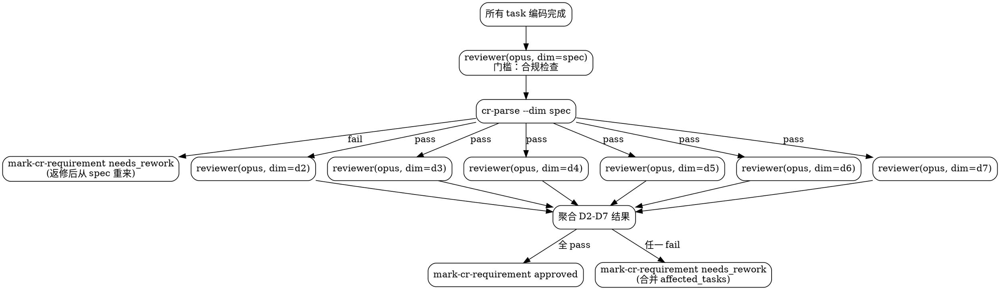

# chisel-review

多维度独立 CR 阶段。所有 task 编码完成后，每个维度由独立的 opus 调用深度审查。不直接改业务代码。

## 当前工作流状态

!`node ${CLAUDE_PLUGIN_ROOT}/hooks/workflow-snapshot.mjs 2>/dev/null || echo "无活跃工作流"`

## 核心理念

CR diff loop 是 chisel 的质量保障核心：审查 → 返修 → 再审查，直到通过。

每个维度独立一次 opus 调用，注意力最集中。通用 reviewer agent 加载不同维度定义文件执行审查。

## 审查维度

| 维度 | 职责 | 阶段 |
|------|------|------|
| spec | AC 覆盖、scope、forbidden files、behavior invariants | 门槛（fail 直接返修） |
| D2 | 并发与分布式安全 | 质量（全量审查后聚合） |
| D3 | 代码去重 | 质量 |
| D4 | 设计原则符合性 | 质量 |
| D5 | 风格一致性 | 质量 |
| D6 | 可维护性与迭代支持 | 质量 |
| D7 | 无效代码清除 | 质量 |

## 执行流程



### 第一步：Spec 门槛

1. `node ${CLAUDE_PLUGIN_ROOT}/scripts/workflow-status.mjs {IDEA_DIR} --next-tasks review`
2. 对所有待 review 的 task，`--start-review <task-id>` 标记为 reviewing
3. 启动 `agent-chisel-reviewer`（opus），传入 TASK：
   ```json
   { "idea_dir": "{IDEA_DIR}", "task_ids": ["task-001", "task-002", ...], "dimension": "spec", "rework_count": 0 }
   ```
4. `node ${CLAUDE_PLUGIN_ROOT}/scripts/cr-parse.mjs {IDEA_DIR} --dim spec`
5. 按结果：
   - **fail** → `node ${CLAUDE_PLUGIN_ROOT}/scripts/workflow-status.mjs {IDEA_DIR} --mark-cr-requirement needs_rework <affected_tasks>`，停止
   - **pass** → 进入第二步

### 第二步：D2-D7 并行质量审查

6. 在**一条消息中**同时发起 6 个 Agent 调用，并行启动 `agent-chisel-reviewer`（opus）：
   ```
   Agent({ description: "CR D2", prompt: TASK({ dimension: "d2", ... }) })
   Agent({ description: "CR D3", prompt: TASK({ dimension: "d3", ... }) })
   Agent({ description: "CR D4", prompt: TASK({ dimension: "d4", ... }) })
   Agent({ description: "CR D5", prompt: TASK({ dimension: "d5", ... }) })
   Agent({ description: "CR D6", prompt: TASK({ dimension: "d6", ... }) })
   Agent({ description: "CR D7", prompt: TASK({ dimension: "d7", ... }) })
   ```
   6 个 reviewer 并行执行，各自读取对应 `dim-{dimension}.md` 定义，互不干扰。

### 第三步：聚合结果

7. 等待所有 6 个 Agent 返回后，逐个运行 `node ${CLAUDE_PLUGIN_ROOT}/scripts/cr-parse.mjs {IDEA_DIR} --dim <dimension>` 解析结果
8. 聚合判定：
   - **全部 pass** → `node ${CLAUDE_PLUGIN_ROOT}/scripts/workflow-status.mjs {IDEA_DIR} --mark-cr-requirement approved`
   - **任一 fail** → 合并所有 fail 维度的 affected_tasks（去重）→ `node ${CLAUDE_PLUGIN_ROOT}/scripts/workflow-status.mjs {IDEA_DIR} --mark-cr-requirement needs_rework <affected_tasks>`

<HARD-GATE>
每个维度独立一次 opus 调用，不合并维度。
spec 是门槛——fail 直接返修，不跑后续质量维度。
D2-D7 在一条消息中并行发起 6 个 Agent 调用，全部返回后聚合结果。
聚合后一次性收集所有问题避免反复返修。
返修后必须从 spec 重新开始，不能跳过。
上次通过不等于这次通过。
同一 task 返修 3 次后会被脚本标记为 blocked。
必须用 cr-parse.mjs 解析 frontmatter，不得根据正文猜测结论。

合理化预防表：

| 你的想法 | 现实 |
|---------|------|
| "spec 已通过，后续维度走个过场" | spec 只管合规，质量需要独立深度审查 |
| "这个维度和本次改动无关，跳过" | 每个维度都必须跑，无关维度 reviewer 自己判定 N/A |
| "改动很小，用一次调用审查多个维度" | 每个维度独立调用，注意力不稀释 |
| "上轮 CR 已经很详细，这轮快过" | 每轮必须独立审查 |
| "CR 报告中说了通过就行" | 必须用 cr-parse.mjs 解析 frontmatter |
| "只有一个 task，不需要完整流程" | 单 task 也走完整 7 维度 |
</HARD-GATE>
