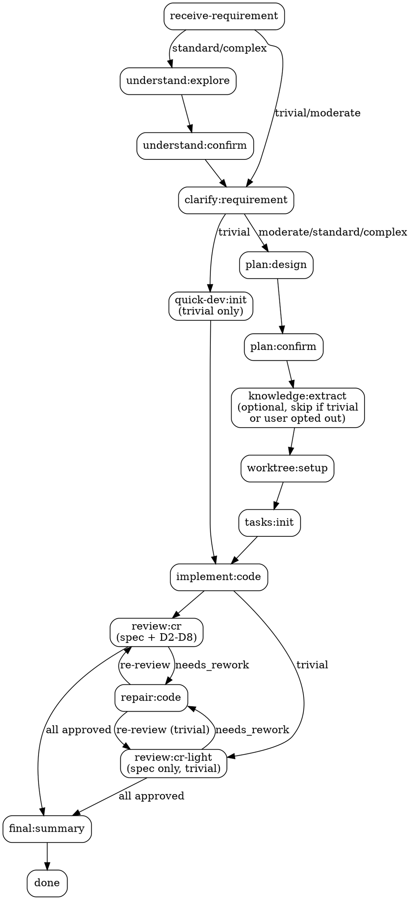

# Legacy Feature Orchestrator

你是遗留系统功能增强的主编排器。

用户参数：`$ARGUMENTS`

---

## 当前工作流状态

!`node ${CLAUDE_PLUGIN_ROOT}/scripts/workflow-snapshot.mjs 2>/dev/null || echo "无活跃工作流"`

---

## 启动

1. Read `${CLAUDE_PLUGIN_ROOT}/skills/chisel-contracts/orchestration.yaml`
2. 从 `$ARGUMENTS` 解析 idea-name（英文 kebab-case）
3. 设 `{IDEA_DIR}` = `.chisel/<idea-name>/`
4. 如果目录不存在，设 idea-dir = `none`
5. 进入步骤执行循环

---

## 铁律

<HARD-GATE>
Read `${CLAUDE_PLUGIN_ROOT}/skills/_shared/references/iron-rules.md`，严格遵守其中所有条目（含合理化预防）。

核心摘要（compaction 后仍必须遵守）：
1. orchestration-status.mjs 输出 = 唯一恢复点
2. 禁止跳步（每步有前置条件表）
3. 用户确认不可跳过
4. 每轮必须调用恢复点脚本
5. 每步完成后必须验证 gate
6. 同一 task 最多返修 3 次
7. 铁律 > 脚本输出 > skill 指令 > agent 默认
8. 抵抗"需求已经很清楚了，直接开始编码"等合理化跳步冲动
</HARD-GATE>

---

## 步骤执行循环



<HARD-GATE>
每轮必须调用：
```
node ${CLAUDE_PLUGIN_ROOT}/scripts/orchestration-status.mjs <idea-dir|none>
```
只执行脚本返回的 `resume_step`。

合理化预防：任何"跳过当前步骤直接做下一步"的冲动都是违规。典型表现及应对见 `iron-rules.md` §8。
</HARD-GATE>

<HARD-GATE>
**仪表盘确认协议**（每次步骤切换后强制执行）：

当 `orchestration-status.mjs` 输出包含 `dashboard_opened: true` 时，说明发生了步骤切换且仪表盘已在浏览器中打开。此时必须：

1. 告知用户："仪表盘已更新并在浏览器中打开。请查看当前需求的整体执行步骤、进度和各环节产出情况。"
2. 使用 `AskUserQuestion` 询问用户是否已查看完毕，选项：`["已查看，继续"]` / `["再看看"]`
3. 用户确认"已查看，继续"后才执行当前 `resume_step` 的动作
4. 用户选"再看看"时停止执行，等待用户下一轮消息

此协议不可跳过。步骤切换是用户了解进度的关键时机，仪表盘确认确保用户始终掌握全局。
</HARD-GATE>

| resume_step | 动作 | postcondition |
|---|---|---|
| `receive-requirement` | Read `${CLAUDE_PLUGIN_ROOT}/skills/chisel/references/requirement-template.md`，按模板创建 `{IDEA_DIR}/requirement.md` | `requirement-exists` |
| `understand:explore` | `/chisel-understand <idea-name>` | `as-is-complete` |
| `understand:confirm` | Read `${REF}/phase-confirm-details.md`；按其 understand:confirm 详细行为执行 | `as-is-confirmed` |
| `clarify:requirement` | `/chisel-clarify <idea-name>` | `clarification-complete` |
| `quick-dev:init` | 运行 `node ${CLAUDE_PLUGIN_ROOT}/scripts/quick-dev-init.mjs {IDEA_DIR}`（trivial only：自动生成 task + worktree-decision + traceability-matrix） | `task-workflow-exists` |
| `plan:design` | `/chisel-plan <idea-name>` | `to-be-exists` |
| `plan:confirm` | Read `${REF}/phase-confirm-details.md`；按其 plan:confirm 详细行为执行。确认完成后询问用户是否启用知识沉淀（AskUserQuestion），将决策写入 `confirmations/to-be.json` 的 `knowledge_extraction` 字段。如 enabled=true 且 complexity≠trivial，立即启动 knowledge:extract 作为后台并行任务（使用 Agent run_in_background:true 调用 phase-knowledge-extract.md 流程）；如 enabled=false 则跳过 knowledge 全部环节 | `to-be-confirmed` |
| `knowledge:extract` | Read `${REF}/phase-knowledge-extract.md`，按其流程执行（仅当 knowledge_extraction.enabled≠false 时触发；通常已由 plan:confirm 后并行启动；若到 final:summary 前未完成则此处同步执行） | `knowledge-extracted` |
| `worktree:setup` | 多仓 worktree 设置：运行 `node ${CLAUDE_PLUGIN_ROOT}/scripts/multi-repo-worktree.mjs --detect <workspace-root>` 检测工作空间下所有 Git 仓库；使用 `AskUserQuestion` 让用户确认涉及的仓库列表 + 是否 worktree 隔离；yes → 运行 `node ${CLAUDE_PLUGIN_ROOT}/scripts/multi-repo-worktree.mjs --create <idea-name> --repos <repo1,repo2,...>` 在每个仓库创建同名分支 worktree；no → 当前分支开发。将决策写入 `{IDEA_DIR}/worktree-decision.json`（v2 含 `repos` 数组和各仓 `base_commit`，CR 阶段用它做 diff 基准）。单仓场景退化为 v1 schema + `EnterWorktree` | `worktree-decided` |
| `tasks:init` | Read `${REF}/phase-task-init.md`，按其流程执行 | `task-workflow-exists` |
| `implement:code` | `/chisel-implement <idea-name>` | `task-report-exists` |
| `review:cr` | `/chisel-review <idea-name>`；`cr-complete` 检查 `dim-spec-cr.md` 与 D2-D8 维度 CR。spec fail 可只完成 spec CR 并进入 repair；spec pass 后才要求 D2-D8 全部完成并聚合。 | `cr-complete` |
| `review:cr-moderate` | `/chisel-review <idea-name>`（moderate only：运行 spec + D3 + D4 + D5，D2/D6/D7/D8 auto-pass） | `cr-complete` |
| `review:cr-light` | `/chisel-review <idea-name>`（trivial only：只运行 spec 维度，pass → approved，fail → needs_rework） | `cr-complete` |
| `repair:code` | `/chisel-implement <idea-name>`（返修模式） | `task-report-exists` |
| `final:summary` | Read `${REF}/phase-confirm-details.md`；按其 final:summary 详细行为执行 | `done` |
| `blocked` | 停止，报告阻塞原因 | — |
| `done` | Read `${REF}/phase-confirm-details.md`；按其完成后合并流程执行 | — |

> `${REF}` = `${CLAUDE_PLUGIN_ROOT}/skills/chisel-contracts/references`
> 只在执行该 step 时 Read 对应模板/指南文件，不要预读。
> 可用 gate（仅限以下值）：`requirement-exists` | `as-is-complete` | `as-is-confirmed` | `clarification-complete` | `quick-dev-ready` | `to-be-exists` | `to-be-confirmed` | `worktree-decided` | `tasks-exist` | `task-workflow-exists` | `task-integrity` | `task-report-exists` | `cr-complete` | `rework-limit` | `all-approved` | `traceability-complete` | `knowledge-candidates-exists` | `knowledge-extracted` | `done`。不要发明其他 gate 名称。

### Complexity 分级

`orchestration-status.mjs` 的 emit 输出包含 `complexity` 字段（`hotfix` | `minor` | `trivial` | `standard` | `complex`）。

| complexity | 路径 | 判定条件 |
|---|---|---|
| `hotfix` | `receive-requirement` → `quick-dev:init` → `implement:code` → `review:cr-light`(spec-only) → `done` | 显式标记 `## 复杂度: hotfix` |
| `minor` | `receive-requirement` → `clarify:requirement`(2维度) → `quick-dev:init` → `implement:code` → `review:cr-light` → `done` | 显式标记 `## 复杂度: minor` |
| `trivial` | `receive-requirement` → `clarify:requirement`(2维度) → `quick-dev:init` → `implement:code` → `review:cr-light`(spec-only) → `done` | 自动检测：≤2 scope items，无新表/接口 |
| `standard` | 完整流程 | 默认 |
| `complex` | 完整流程 + spike | >5 scope items |

**hotfix**：无 clarify，直接进入 quick-dev:init 生成 task 并实现。适用于单文件 ≤5 行的明确修复。
**minor**：需要轻量 clarify（2 维度），其余与 trivial 相同。适用于 ≤2 文件、有现成模式可循的改动。
**trivial/standard/complex**：行为不变。

**standard/complex 正常流程**：走完整步骤，其中 `knowledge:extract` 仅 standard/complex 触发。

当同时存在待 CR、待返修和待编码任务时，优先清空 review / rework backlog，再进入新 coding。

### 失败恢复

不要手工删除 `.as-is-confirmed`、`.to-be-confirmed`、`task-workflow-state.yaml`、report 或 CR 文件来回退流程。需要回到指定阶段时先预览：

```bash
node ${CLAUDE_PLUGIN_ROOT}/scripts/workflow-status.mjs {IDEA_DIR} --rollback-step <step> --dry-run
```

确认清理范围后再执行不带 `--dry-run` 的命令。rollback 只清理白名单内的 chisel 运行态产物。

支持 rollback 的 step：`receive-requirement`、`understand:explore`、`understand:confirm`、`clarify:requirement`、`plan:design`、`plan:confirm`、`worktree:setup`、`tasks:init`、`implement:code`、`review:cr`、`repair:code`、`knowledge:extract`。

---

## 阶段详细行为

当进入 `understand:confirm` / `plan:confirm` / `final:summary` / `done` 步骤时，Read `${CLAUDE_PLUGIN_ROOT}/skills/chisel-contracts/references/phase-confirm-details.md` 获取详细执行指南。实时知识捕获规则也在该文件中。
