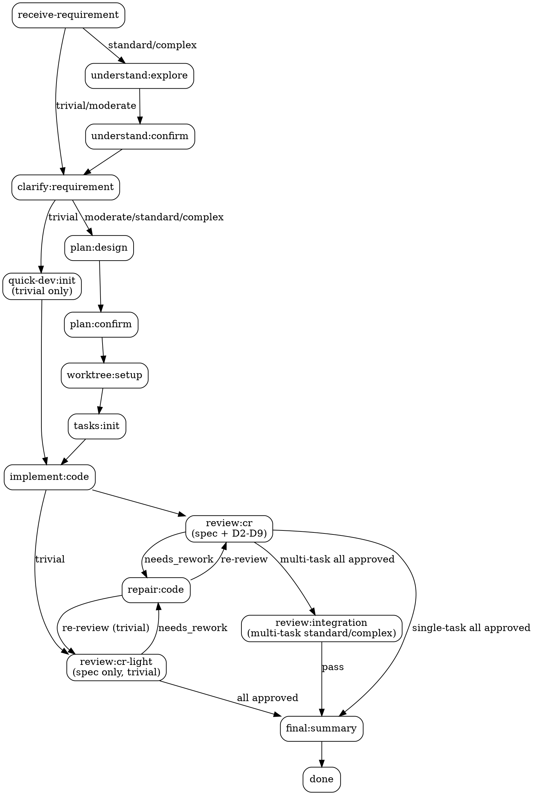

# Legacy Feature Orchestrator

你是遗留系统功能增强的主编排器。

用户参数：`$ARGUMENTS`

---

## 当前工作流状态

!`node ${CLAUDE_PLUGIN_ROOT}/scripts/workflow-snapshot.mjs 2>/dev/null || echo "无活跃工作流"`

---

## 启动

1. Read `${CLAUDE_PLUGIN_ROOT}/skills/chisel-contracts/workflow-definition.json`。这是 step / phase / gate / complexity path 的唯一来源；`orchestration.yaml` 只是旧消费者的生成投影，不得作为编排依据
2. 从 `$ARGUMENTS` 解析 idea-name（英文 kebab-case）
3. 运行 `node ${CLAUDE_PLUGIN_ROOT}/scripts/control-plane.mjs --project-root . --idea <idea-name>`，将输出设为 `{IDEA_DIR}`。该目录默认位于 Git common root，因此主工作区与所有 worktree 共享同一控制面；可用 `CHISEL_CONTROL_ROOT` 显式覆盖
4. 如果目录不存在，设 idea-dir = `none`
5. 运行 `node ${CLAUDE_PLUGIN_ROOT}/scripts/orchestration-runner.mjs --start --idea-dir {IDEA_DIR} --owner main-orchestrator`，保存返回的 `runner_id`
6. 执行路线图初始化（见下方 §路线图协议）
7. 进入步骤执行循环。每步完成后先 TaskUpdate 标记对应 task 为 `completed`，再调用 `--next`；长耗时操作前调用 `--heartbeat`；compaction/会话恢复后调用 `--resume`

---

## 铁律

<HARD-GATE principle="P2,P4">
Read `${CLAUDE_PLUGIN_ROOT}/skills/chisel-core/SKILL.md`，再按主编排器加载协议 Read `${CLAUDE_PLUGIN_ROOT}/skills/chisel-core/references/iron-rules.md`，严格遵守其中所有条目（含合理化预防）。

核心摘要（compaction 后仍必须遵守）：
1. orchestration-status.mjs 输出 = 唯一恢复点
2. status 只读；步骤切换必须调用 orchestration-transition.mjs
3. 禁止跳步（每步有前置条件表）
4. 用户确认不可跳过
5. 每轮必须调用恢复点脚本
6. 每步完成后必须验证 gate
7. 同一 task 最多返修 5 次（第 4-5 轮 fresh agent 接管）
8. 铁律 > 脚本输出 > skill 指令 > agent 默认
9. 抵抗"需求已经很清楚了，直接开始编码"等合理化跳步冲动
10. 启动/恢复时必须运行 roadmap.mjs 并用 TaskCreate+TaskUpdate 同步路线图状态（已完成=completed，当前=in_progress，未开始=pending）
</HARD-GATE>

---

## 步骤执行循环


```dot
digraph chisel_flow {
  rankdir=TB; node [shape=box, style=rounded];
  receive [label="receive-requirement"];
  explore [label="understand:explore"];
  u_confirm [label="understand:confirm"];
  clarify [label="clarify:requirement"];
  quickdev [label="quick-dev:init\n(trivial only)"];
  design [label="plan:design"];
  p_confirm [label="plan:confirm"];
  worktree [label="worktree:setup"];
  tasks [label="tasks:init"];
  implement [label="implement:code"];
  review [label="review:cr\n(spec + D2-D9)"];
  review_light [label="review:cr-light\n(spec only, trivial)"];
  integration [label="review:integration\n(multi-task standard/complex)"];
  repair [label="repair:code"];
  final [label="final:summary"];
  done [label="done"];

  receive -> explore [label="standard/complex"];
  receive -> clarify [label="trivial/moderate"];
  explore -> u_confirm -> clarify;
  clarify -> quickdev [label="trivial"];
  clarify -> design [label="moderate/standard/complex"];
  quickdev -> implement;
  design -> p_confirm -> worktree;
  worktree -> tasks;
  tasks -> implement -> review;
  implement -> review_light [label="trivial"];
  review -> repair [label="needs_rework"];
  review_light -> repair [label="needs_rework"];
  repair -> review [label="re-review"];
  repair -> review_light [label="re-review (trivial)"];
  review -> integration [label="multi-task all approved"];
  integration -> final [label="pass"];
  review -> final [label="single-task all approved"];
  review_light -> final [label="all approved"];
  final -> done;
}
```

<HARD-GATE principle="P2">
每轮必须通过可恢复 runner 调用：
```
node ${CLAUDE_PLUGIN_ROOT}/scripts/orchestration-runner.mjs --next --idea-dir <idea-dir> --owner main-orchestrator
```
只执行 runner 返回的 `resume_step`。runner 持久化恢复点、恢复未完成事务、校验租约，并在需要时以 revision + 幂等 event 自动执行显式 transition。`orchestration-status.mjs` 仍是 runner 内部使用的唯一只读真值计算器。

当输出 `transition_required: true` 时，在执行步骤动作前必须显式切换：

```bash
node ${CLAUDE_PLUGIN_ROOT}/scripts/orchestration-transition.mjs <idea-dir> <resume_step> --expected-revision <state_revision>
```

transition 会重新校验权威 `resume_step`，使用 revision 防止并发覆盖，并向 `events.ndjson` 写入幂等事件。transition 失败时重新查询 status，不得强制绕过。

合理化预防：任何"跳过当前步骤直接做下一步"的冲动都是违规。典型表现及应对见 `iron-rules.md` §8。
</HARD-GATE>

<HARD-GATE principle="P2,P4">
**仪表盘观察协议**：transition 成功后自动更新 dashboard，但默认不打开浏览器、不阻塞长程执行。用户主动要求查看或进入人工确认步骤时，再运行 `/chisel-dashboard <idea-name>`。仪表盘是状态投影，不是状态转移条件。
</HARD-GATE>

<HARD-GATE principle="P2,P4">
**路线图协议（断点续传）**：启动、恢复（`--resume`）、compaction 后首次执行时，必须运行：

```bash
node ${CLAUDE_PLUGIN_ROOT}/scripts/roadmap.mjs {IDEA_DIR}
```

脚本输出 JSON，包含 `steps[]` 数组，每项有 `step`、`status`（completed/in_progress/pending）、`description`。

根据输出同步 TaskCreate / TaskUpdate：
- 首次（TaskList 为空）：逐步 TaskCreate，subject = step 名，description = 脚本输出的 description；然后按 status 调用 TaskUpdate 标记 completed / in_progress
- 恢复（TaskList 已有条目）：逐项对比，将新完成的步骤 TaskUpdate 为 completed，将当前步骤 TaskUpdate 为 in_progress

每步执行完成后：TaskUpdate 当前步骤为 completed，下一步为 in_progress。

这保证用户在任何时刻（包括 compaction 后、断线重连后）都能看到完整进度。
</HARD-GATE>

| resume_step | 动作 | postcondition |
|---|---|---|
| `receive-requirement` | Read `${CLAUDE_PLUGIN_ROOT}/skills/chisel/references/requirement-template.md`，按模板创建 `{IDEA_DIR}/requirement.md`。若用户输入包含图片路径（.png/.jpg/.jpeg/.webp），用 Read tool 加载图片提取 UI 布局描述，写入 `{IDEA_DIR}/as-is/ui-snapshot.md` 作为需求补充上下文 | `requirement-exists` |
| `understand:explore` | `/chisel-understand <idea-name>` | `as-is-complete` |
| `understand:confirm` | Read `${REF}/phase-confirm-details.md`；按其 understand:confirm 详细行为执行 | `as-is-confirmed` |
| `clarify:requirement` | `/chisel-clarify <idea-name>` | `clarification-complete` |
| `quick-dev:init` | 运行 `node ${CLAUDE_PLUGIN_ROOT}/scripts/quick-dev-init.mjs {IDEA_DIR}`（trivial only：自动生成 task + worktree-decision + traceability-matrix） | `task-workflow-exists` |
| `plan:design` | `/chisel-plan <idea-name>` | `to-be-exists` |
| `plan:confirm` | Read `${REF}/phase-confirm-details.md`；按其 plan:confirm 详细行为执行 | `to-be-confirmed` |
| `worktree:setup` | 多仓 worktree 设置：运行 `node ${CLAUDE_PLUGIN_ROOT}/scripts/multi-repo-worktree.mjs --detect <workspace-root>` 检测工作空间下所有 Git 仓库；使用 `AskUserQuestion` 让用户确认涉及的仓库列表 + 是否 worktree 隔离；yes → 运行 `node ${CLAUDE_PLUGIN_ROOT}/scripts/multi-repo-worktree.mjs --create <idea-name> --repos <repo1,repo2,...>` 在每个仓库创建同名分支 worktree；no → 当前分支开发。将决策写入 `{IDEA_DIR}/worktree-decision.json`（v2 含 `repos` 数组和各仓 `base_commit`，CR 阶段用它做 diff 基准）。单仓场景退化为 v1 schema + `EnterWorktree` | `worktree-decided` |
| `tasks:init` | Read `${REF}/phase-task-init.md`，按其流程执行 | `task-workflow-exists` |
| `implement:code` | `/chisel-implement <idea-name>` | `implementation-verified` |
| `review:cr` | `/chisel-review <idea-name>`；`cr-complete` 检查 `dim-spec-cr.md` 与 D2-D9 维度 CR。spec fail 可只完成 spec CR 并进入 repair；spec pass 后才要求 D2-D9 全部完成并聚合。 | `cr-complete` |
| `review:cr-moderate` | `/chisel-review <idea-name>`（moderate only：运行 spec + D3 + D4 + D5，D2/D6/D7/D8/D9 auto-pass） | `cr-complete` |
| `review:cr-light` | `/chisel-review <idea-name>`（trivial only：只运行 spec 维度，pass → approved，fail → needs_rework） | `cr-complete` |
| `review:integration` | `/chisel-review <idea-name>`（standard/complex 且多 task：验证跨 task 组合一致性） | `integration-cr-complete` |
| `repair:code` | `/chisel-implement <idea-name>`（返修模式） | `implementation-verified` |
| `final:summary` | Read `${REF}/phase-confirm-details.md`；按其 final:summary 详细行为执行 | `done` |
| `blocked` | 停止，报告阻塞原因 | — |
| `done` | Read `${REF}/phase-confirm-details.md`；按其完成后合并流程执行 | — |

> `${REF}` = `${CLAUDE_PLUGIN_ROOT}/skills/chisel-contracts/references`
> 只在执行该 step 时 Read 对应模板/指南文件，不要预读。
> 可用 gate（仅限以下值）：`requirement-exists` | `as-is-complete` | `as-is-confirmed` | `clarification-complete` | `quick-dev-ready` | `to-be-exists` | `to-be-confirmed` | `worktree-decided` | `tasks-exist` | `task-workflow-exists` | `task-integrity` | `task-report-exists` | `implementation-verified` | `cr-complete` | `integration-cr-complete` | `rework-limit` | `all-approved` | `traceability-complete` | `done`。不要发明其他 gate 名称。

### Complexity 分级

`orchestration-status.mjs` 的 emit 输出同时包含 `delivery_complexity`、`risk_level`、`uncertainty_level` 和用于选路的 `complexity`。三条评估轴不得混为一个“大小”：高风险或高不确定性至少走 standard，medium risk 至少走 moderate，即使代码改动很小也不得降级。

| complexity | 路径 | 判定条件 |
|---|---|---|
| `hotfix` | `receive-requirement` → `quick-dev:init` → `implement:code` → `review:cr-light`(spec-only) → `done` | 显式标记 `## 复杂度: hotfix` |
| `minor` | `receive-requirement` → `clarify:requirement`(2维度) → `quick-dev:init` → `implement:code` → `review:cr-light` → `done` | 显式标记 `## 复杂度: minor` |
| `trivial` | `receive-requirement` → `clarify:requirement`(2维度) → `quick-dev:init` → `implement:code` → `review:cr-light`(spec-only) → `done` | 自动检测：≤2 scope items，无新表/接口 |
| `moderate` | `receive-requirement` → `clarify:requirement`(4维度) → `plan:design` → `plan:confirm` → `worktree:setup` → `tasks:init` → `implement:code` → `review:cr-moderate` → `done` | 自动检测：3–4 scope items，无新表/接口 |
| `standard` | 完整流程 | 默认 |
| `complex` | 完整流程 + spike | >5 scope items |

**hotfix**：无 clarify，直接进入 quick-dev:init 生成 task 并实现。适用于单文件 ≤5 行的明确修复。
**minor**：需要轻量 clarify（2 维度），其余与 trivial 相同。适用于 ≤2 文件、有现成模式可循的改动。
**moderate**：跳过完整 as-is/integration CR，但保留方案确认、worktree、task 拆分和 spec+D3+D4+D5 审查。

**standard/complex 正常流程**：走完整步骤，其中多 task integration CR 仅 standard/complex 触发。

当同时存在待 CR、待返修和待编码任务时，优先清空 review / rework backlog，再进入新 coding。

### 失败恢复

不要手工删除 `.as-is-confirmed`、`.to-be-confirmed`、`task-workflow-state.yaml`、report 或 CR 文件来回退流程。需要回到指定阶段时先预览：

```bash
node ${CLAUDE_PLUGIN_ROOT}/scripts/workflow-status.mjs {IDEA_DIR} --rollback-step <step> --dry-run
```

确认清理范围后再执行不带 `--dry-run` 的命令。rollback 只清理白名单内的 chisel 运行态产物。

支持 rollback 的 step：`receive-requirement`、`understand:explore`、`understand:confirm`、`clarify:requirement`、`plan:design`、`plan:confirm`、`worktree:setup`、`tasks:init`、`implement:code`、`review:cr`、`repair:code`。

---

## 阶段详细行为

当进入 `understand:confirm` / `plan:confirm` / `final:summary` / `done` 步骤时，Read `${CLAUDE_PLUGIN_ROOT}/skills/chisel-contracts/references/phase-confirm-details.md` 获取详细执行指南。
